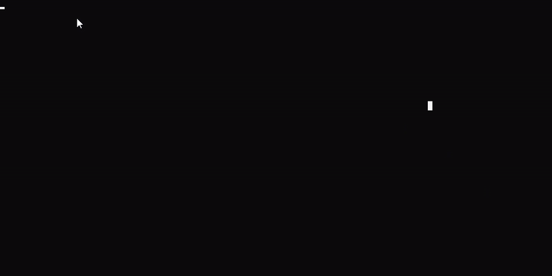

# HelloGit

The first repository on this account - I can think of no better project to start with than my own 'Hello World'.
This is a simple C++ project that 'animates' the text in two different styles, as shown here:

There are currently only two animation states available:
- wordBlink
- charBlink

These states can be stacked/ arranged in any pattern using the animStates function vector, and are invoked in the LoopCharacterAnimation function.
